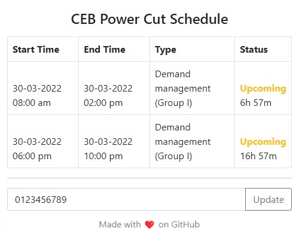

  

<h1 align="center">CEB Power Cut Schedule Extension</h1>

	

*Simple extension for Chrome web browser to view details about power outages in Sri Lanka.*

## Installing

1. Go to the Chrome extensions page (`chrome://extensions`)
2. Enable Developer mode.
3. Download this repository as a [Zip file](https://github.com/bandaranayake/ceb-power-cut-schedule-extension/archive/refs/heads/main.zip) from GitHub.
4. Unzip the downloaded Zip file.
5. Go to `ceb-power-cut-schedule-extension-main` folder.
5. Drag the `src` folder to the extensions page to install the extension.

## Built With
* <a href='https://getbootstrap.com/docs/5.0'>Bootstrap v5.0</a>
* <a href='https://www.freepik.com/vectors/blackout'>Icon: Blackout vector created by freepik - www.freepik.com</a>